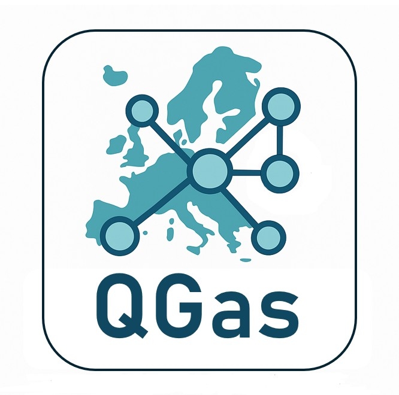

<div align="center">

<!-- Main QGas Logo -->


</div>

<div align="center">

<!-- Logos von TU Graz und IEE -->


</div>

<div align="justify">

# QGas – Interactive Gas Infrastructure Toolkit

QGas is an **interactive software toolkit** designed for the visualization, exploration, and modification of gas infrastructure networks through a **map-based interface**.  
The toolkit provides researchers, engineers, and energy analysts with the ability to intuitively manage complex gas networks while preserving the **integrity of the underlying network topology**.  
Its design emphasizes **usability, flexibility, and topological consistency**, enabling both detailed operational edits and large-scale network modifications without compromising structural properties.

---

# Features

- **Topology-preserving network modifications:** QGas allows users to manipulate pipeline geometries and node positions while ensuring that the network's connectivity, flow paths, and topological characteristics remain intact.  
- **Interactive pipeline creation and rerouting:** Users can seamlessly draw new pipelines, adjust existing routes, or create new connections between nodes using an intuitive, map-based graphical interface.  
- **Flexible infrastructure management:** The toolkit supports the addition of new infrastructure types beyond conventional gas pipelines, including hydrogen pipelines, storage facilities, LNG terminals, and other energy-relevant assets.  
- **Advanced attribute management:** QGas provides a robust mechanism for managing metadata and attributes associated with infrastructure elements. Users can create new attributes, edit existing ones, or remove unnecessary attributes through a straightforward interface.  
- **Georeferenced background map integration:** Users can import infrastructure plans or other spatial data as images, georeference them accurately, and overlay them as a reference for network construction.  

---

# Requirements

QGas operates within a **Python environment managed via Conda**. All necessary software dependencies are included in the provided `environment.yml` file.

To set up the environment, please follow the instructions from the [Conda Activation Scripts repository](https://github.com/IEE-TUGraz/Conda-Activation-Scripts/tree/34c1465c7097fcc06b2a308e033b505e214bd03a), which guides you through creating and activating the Conda environment for QGas.

Once the environment is activated, all required packages and libraries for running QGas are available, enabling immediate use of the toolkit's full functionality.

---

# Documentation

A comprehensive **user manual** is available in the Manual.pdf file.  
The manual provides detailed guidance on all aspects of QGas, including the creation and modification of pipelines, editing of nodes, management of infrastructure attributes, integration of multiple datasets, and the use of georeferenced background maps.  

---

# License

QGas is released under the **MIT License**, allowing free use, modification, and distribution of the software with proper attribution.

---

# Acknowledgements

To facilitate testing and to demonstrate the data structure used by QGas, a sample dataset has been included in the repository.  
The **IGGIELGNC-1 dataset from SciGRID_gas** has been converted into the QGas data format and is provided in the `Input` folder of this repository.  

For more information about the original dataset, see the [Zenodo record](https://zenodo.org/records/5509988).

```bibtex
@misc{SciGRID_gas_IGGIELGNC1,
  author = {Diettrich, J. and Pluta, A. and Medjroubi, W. and Dasenbrock, J. and Sandoval, J. E.},
  title  = {SciGRID_gas IGGIELGNC-1 (0.2) [Data set]},
  year   = {2021},
  publisher = {Zenodo},
  doi    = {10.5281/zenodo.5509988},
  url    = {https://doi.org/10.5281/zenodo.5509988}
}
```

---

# Cite QGas

If you use QGas in your research, publications, or technical work, please cite the toolkit to acknowledge the development team and the supporting institute, and to support reproducibility of your results.  

Currently, you can reference the GitHub repository:

```bibtex
@misc{QGAS,
   author = {Marco Quantschnig and Thomas Klatzer and Yannick Werner},
   title = {{QGas – Interactive Gas Infrastructure Toolkit}},
   howpublished = {\url{https://github.com/IEE-TUGraz/QGas}},
   year = {2025},
   note = {Developed at the Institute of Electricity Economics and Energy Innovation (IEE), Graz University of Technology, Austria}
}
```

---

# Contributors
<table>
  <tbody>
    <tr>
      <td align="center" valign="top" width="9.5%"><a href="https://github.com/Mquan07-M"><br /><sub><b>Marco Quantschnig</b></sub></a></td>
      <td align="center" valign="top" width="14.28%"><a href="https://github.com/tklatzer"><br /><sub><b>Thomas Klatzer</b></sub></a></td>
      <td align="center" valign="top" width="14.28%"><a href="https://github.com/yannickwerner"><br /><sub><b>Yannick Werner</b></sub></a></td>
    </tr>
  </tbody>
</table>

</div>