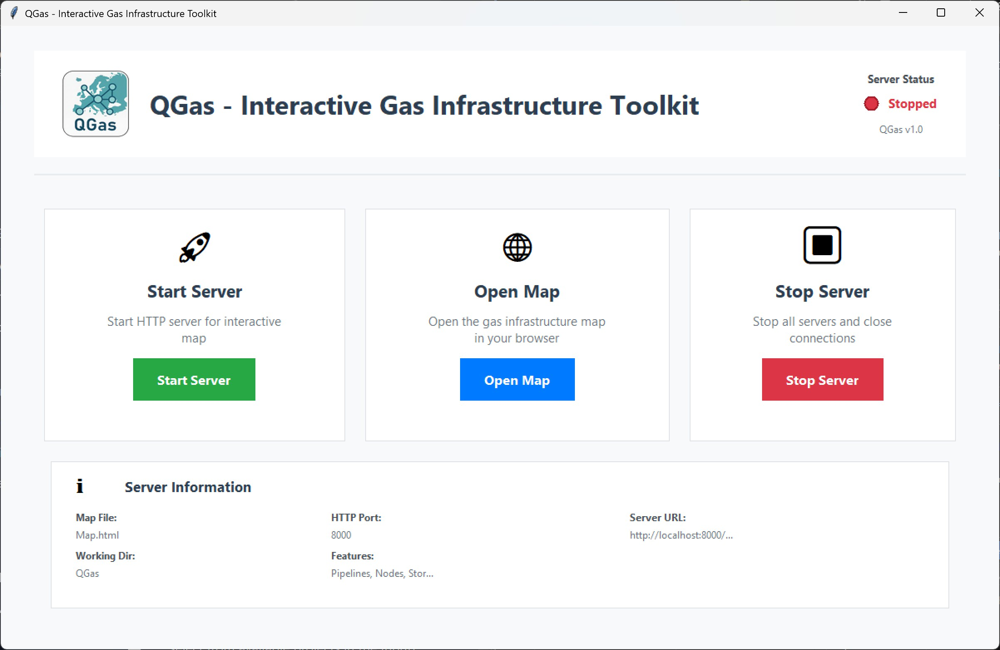

QGas / User Guide / Interface Overview

<h1>Interface Overview</h1>

QGas consists of a <strong>Desktop GUI</strong> for server management and a <strong>web-based map interface</strong> for data visualization and editing. Expand any section below for a detailed description.

<h2>Desktop GUI</h2>

Desktop Controls

<strong>QGas Logo and Branding</strong> - Displays the QGas, TU Graz, and IEE logos with version information.

<strong>Server Status LED</strong> - Indicates whether the local server is stopped or running.

<strong>Start Server</strong> - Starts the local HTTP server on port 8000.

<strong>Open Map</strong> - Opens the interactive map interface in the default web browser.

<strong>Stop Server</strong> - Safely shuts down the local server.

<strong>Information Panel</strong> - Displays technical details such as the server port, URL, and working directory.

<strong>Project Selection</strong> - Selects an available project from the <code>Input/</code> directory.

<h2>Web Interface</h2>

Map View

The central Leaflet.js map displays the active project on OpenStreetMap tiles. Drag the map to pan and use the mouse wheel or pinch gestures to zoom. Loading the background tiles requires an internet connection.

Logo and Quick Actions

The top-left area contains the QGas, TU Graz, and IEE logos together with three quick actions:

<ul>
<li><strong>Cite This Project</strong> - Opens the citation information.</li>
<li><strong>Data and Licensing</strong> - Displays the licensing information for the active project.</li>
<li><strong>Documentation</strong> - Opens this documentation in a new browser tab.</li>
</ul>

Tools and Active Tool

<strong>Tools</strong> opens the toolbox containing the specialized editing and topology tools. The <strong>Active Tool</strong> display immediately below it shows the currently selected mode. See <a href="../tools/">Toolkit / Tools</a> for the full collapsible tool reference.

Screenshot

Activates a clean screenshot mode that hides the interface controls and legend. Press <strong>ESC</strong> to leave Screenshot Mode. The Find ID controls are also hidden while this mode is active.

Export

Opens the export dialog. GeoJSON and CSV exports preserve the QGas layer structure. When supported by the browser, a destination directory can be selected through the folder picker.

<ol>
<li><strong>Export Complete Dataset</strong> - Exports the entire project while preserving its directory and layer structure.</li>
<li><strong>Export Filtered Data</strong> - Exports the elements retained by the active country filter.</li>
<li><strong>Export Changes</strong> - Exports changed elements together with the contributor information in <code>last_changed</code>.</li>
</ol>

Groups

Opens an overview of grouped pipeline elements. Selecting a group highlights and centers its members and displays the member count and total length.

Filter

Filters the project by country. Pipelines are matched using country and NUTS information at both endpoints, including <code>nuts3_start</code> and <code>nuts3_end</code>. If either endpoint belongs to a selected country, the pipeline and both referenced endpoint nodes are retained to prevent floating references.

A point element with one node reference, such as a storage or power plant, follows the country of its referenced node rather than its own map position. All configured line layers are filtered consistently. Use <strong>Clear Filters</strong> to reset the selection or <strong>Apply</strong> to activate it.

Options

Opens the display settings for infrastructure layers. Available settings include layer colors, marker sizes, line widths, line patterns, monochromatic map mode, automatic screenshots before editing operations, and the default screenshot format.

Log

QGas creates one text-based audit log for each browser session after the contributor is selected. Logs are stored in <code>Input/&lt;project&gt;/Audit_Logs/Session_&lt;session ID&gt;.txt</code>. Each entry records the local time, change type, element ID, active tool, and relevant previous and new values or positions.

The <strong>Log</strong> button next to <strong>Options</strong> opens the current session log. Consecutive entries belonging to one committed tool action are grouped and collapsible. Preview selections and discarded edits are not recorded.

↶ Undo

Opens the selective session undo history. QGas retains affected feature snapshots for up to 50 actions or 25 MB without copying complete layers. Select one or more actions and press <strong>Undo Changes</strong> to restore them. Multi-element operations are reverted together and every reversal is written to the Session Audit Log. The undo history is cleared when QGas is restarted.

Legend and Layer Controls

The legend on the right lists all layers of the active project. Each checkbox controls the visibility of its layer. Layers created or imported through the editing tools are added automatically.

<ul>
<li><strong>Select All</strong> - Toggles all infrastructure layers.</li>
<li><strong>Statistics</strong> - Opens element counts, pipeline-length summaries, attribute coverage, and charts.</li>
<li><strong>Remove</strong> - Activates Remove Mode. Selecting a legend entry permanently removes that layer and its elements.</li>
<li><strong>Rename</strong> - Activates Rename Mode. Selecting a layer name opens its inline name editor.</li>
</ul>

Contributor

The contributor field records who made changes during the current session. Unchanged source elements use <code>last_changed: original</code>; committed geometry, attribute, topology, or deletion changes update the field with the active contributor name.

Find ID

Enter an object ID and start the search to center and highlight the matching active feature. Matching is case-insensitive. Other elements remain visible and the current layer visibility states do not change. The search controls are hidden in Screenshot Mode.

OpenStreetMap Attribution

The OpenStreetMap copyright notice is displayed in the bottom-right corner as required by the OpenStreetMap license.

<h2>Keyboard Shortcuts</h2>

<ul>
<li><strong>ESC</strong> - Exit the current screenshot or tool mode.</li>
<li><strong>Ctrl + Mouse Wheel</strong> - Zoom the map.</li>
<li><strong>Ctrl + F5</strong> - Hard-refresh the browser and clear its cached page resources.</li>
</ul>

<b>Tip for New Users</b> 
Start with <strong>Info Mode</strong> to inspect element attributes and understand the dataset before making modifications.

