
QGas / User Guide / Tools

<h1>Toolkit / Tools</h1>

This section presents the in-depth description of the full QGas toolkit. The selected function is highlighted in blue. The individual functionalities of QGas are described in the following subsections.

Info Mode

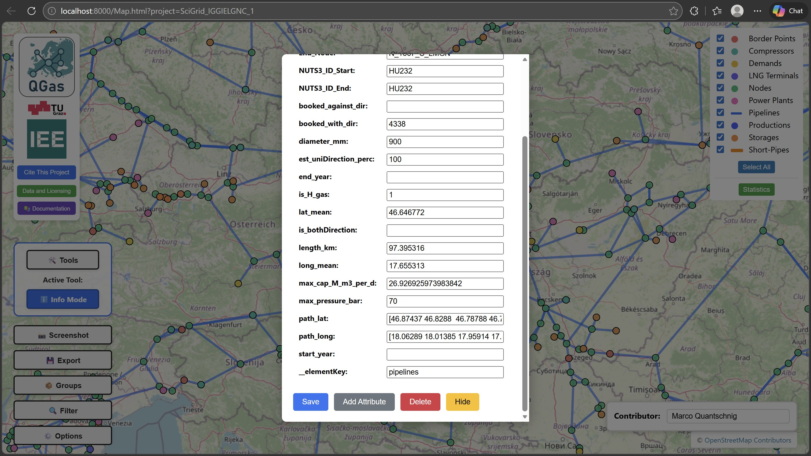

In Info Mode, clicking on an element of the dataset toggles a pop-up showing its attributes. In this pop-up, missing data can be inserted or existing data can be updated. Furthermore, in this mode, three different functionalities allow the user to alter the set of attributes of the corresponding infrastructure element type. These functionalities are:

<ul>
<li>Add Attribute - Adds a new component-specific attribute by setting name and default value for it</li>
<li>Delete - Delete unwanted or unnecessary attributes for all elements of a certain type</li>
<li>Hide - Hide attributes. Hidden attributes remain in the dataset but are not longer shown in the attribute pop-up</li>
 </ul>

Edit Geometry

The Edit Geometry tool is used to change the geometry of the dataset. There are two options within this tool - either to reposition a node or to change the route of a pipeline segment.

<strong>Change Node Position</strong>

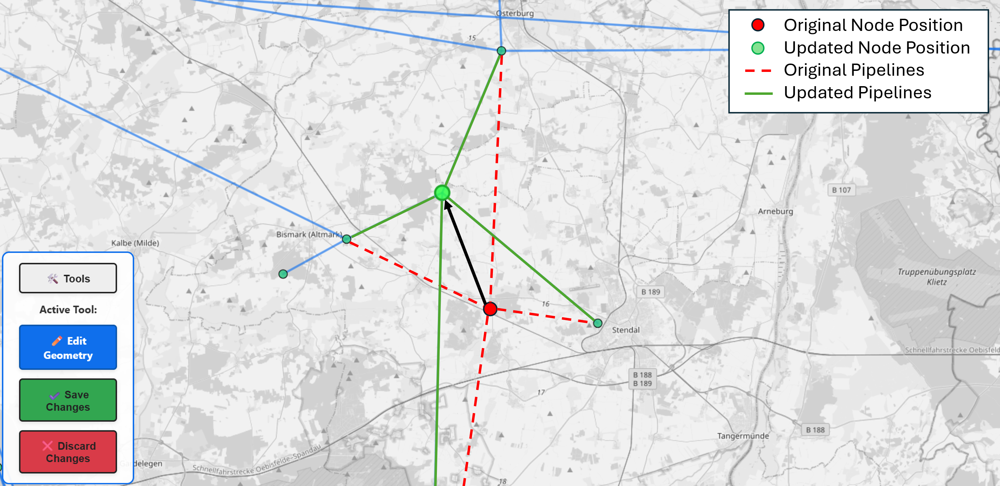

For repositioning, the user has to click on the desired node or in-line type element and drag-and-drop it in the desired location. All pipelines connected to this node keep their connection. The location change is visually illustrated to demonstrate the topological integrity of the dataset. Changes can be saved or discarded by clicking the corresponding button in the toolbox.

<strong>Change Pipeline Route</strong>

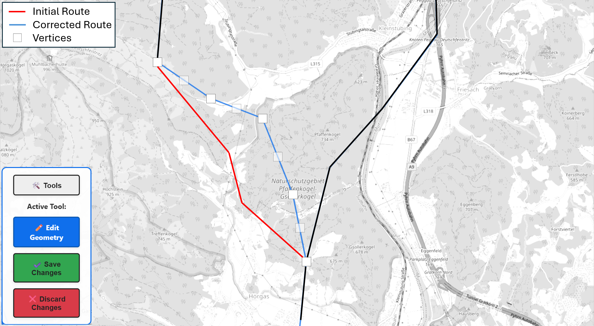

In the Edit Geometry mode select change pipeline route. When clicking on a pipeline segment, the vertices of this segment, represented by white boxes, become visible. Via drag and drop, these boxes then can be repositioned. Clicking on active vertices, allows to add additional vertices to the left and right of the selected vertex.

Add Pipeline

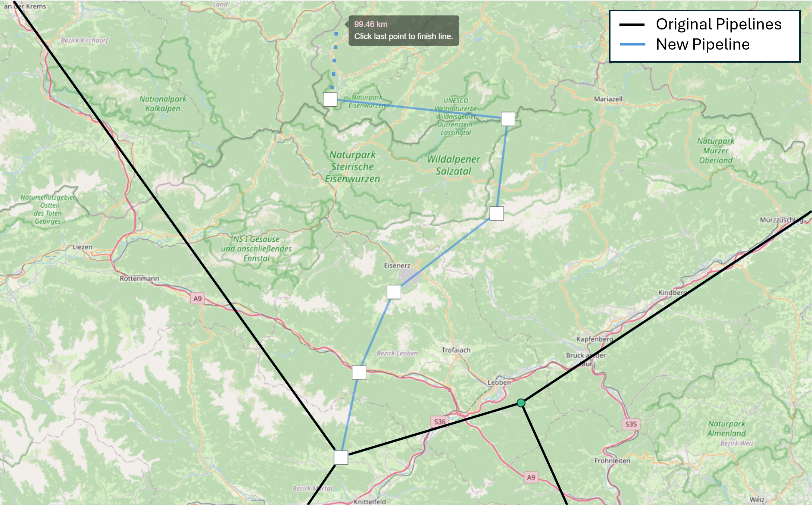

In the Add Pipeline mode, new pipeline segments can be added to the existing dataset. It is possible to add a pipeline to every active line-type layer of the project. After entering the tool, the user must select the target layer via a drop-down menu. Afterward, there are two pop-ups that ask whether the new pipeline is attached to an existing node at the start or end. After this prompt, the user can draw the new pipeline by placing the vertices on the corresponding locations. The length of the new pipeline is calculated during this process. The new element has the same data structure as the other pipeline elements.

Add Infrastructure

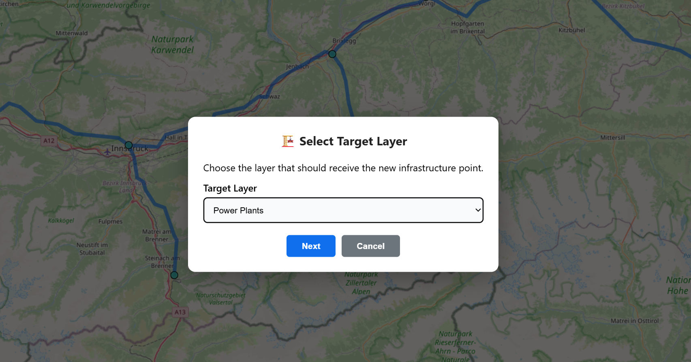

With the Add Infrastructure tool, the user can add new gas infrastructure points such as power plants, LNG terminals, or gas storage units to the dataset. Elements can be added in every active point-type layer. At first, the user has to select whether the new infrastructure is connected to an existing node or not. If the infrastructure is connected to an existing node, the user has to click on the desired node. After that, the location of the infrastructure point must be selected by clicking on the planned location directly on the map. In the placement process, a drop-down selection appears, where the user can select the layer the new element belongs to. Depending on the selected layer, the new element gets a different component-specific data structure assigned.

Change Direction

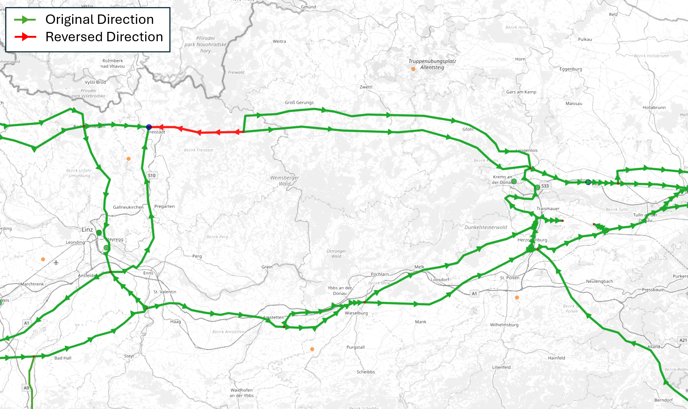

Each pipeline segment is defined by a start and end node, which is assumed to coincide with the standard gas flow direction. The Change Direction functionality allows inverting the direction by switching the node IDs of the start and end node while maintaining the remaining network topology. When entering this function, each pipeline segment is represented as a green line with green triangles indicating the flow direction. Clicking on a pipeline segment inverts the standard flow direction and changes its color to red.

Short Pipe

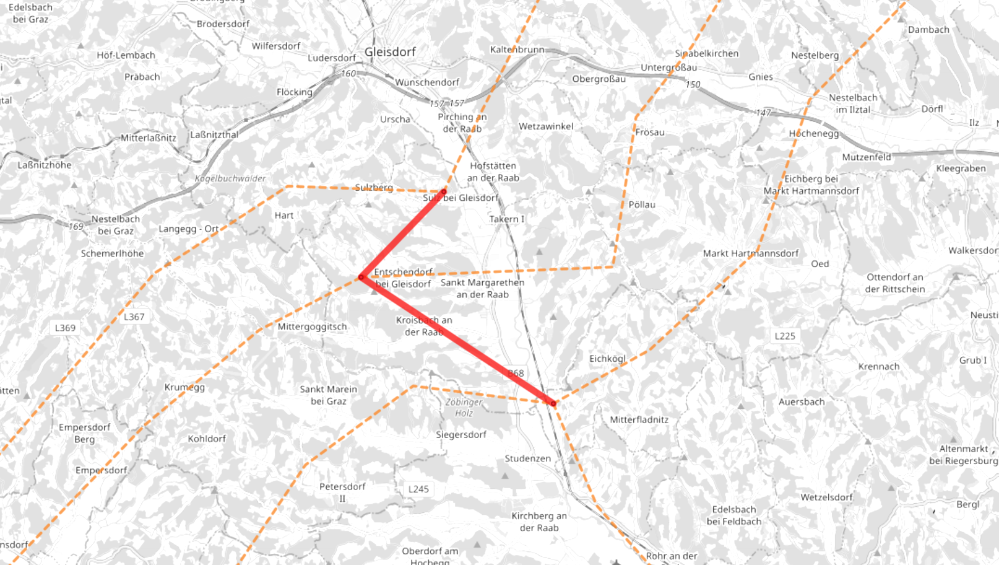

In publicly available sources, looped pipelines are often visualized as two or three parallel pipelines with a relatively large distance in between for better visibility. In reality, however, they are usually right next to each other and might be physically coupled at certain locations, e.g., when they are connected to other pipelines. This may require adding connections between the parallel pipelines, which should not restrict the actual gas flow. We call these connections Short Pipes and assign them a 9999 mm diameter and 0 m length. Existing pipelines can be changed to short pipes with the corresponding tool. This leads to additional pipeline segments at locations where the individual pipelines are connected to each other. These additional pipeline segments should not limit the gas flow of the network, as they are no physical elements.

Delete

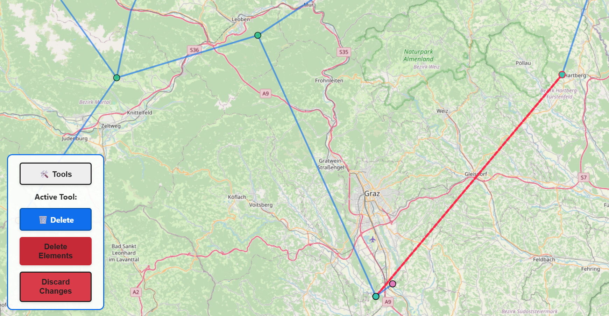

In the Delete Mode, the user can delete all types of elements. This is done by first marking all elements which should be deleted. All marked elements are represented by a red line if it is a line-type element or a red outlining if it is a point-type element. After the selection is completed, the user can confirm the process by clicking "Delete Elements" in the toolbox. All marked elements are then removed from the dataset and all export options. If the user wants to abort the changes then the button "Discard Changes" is used.

Group Pipelines

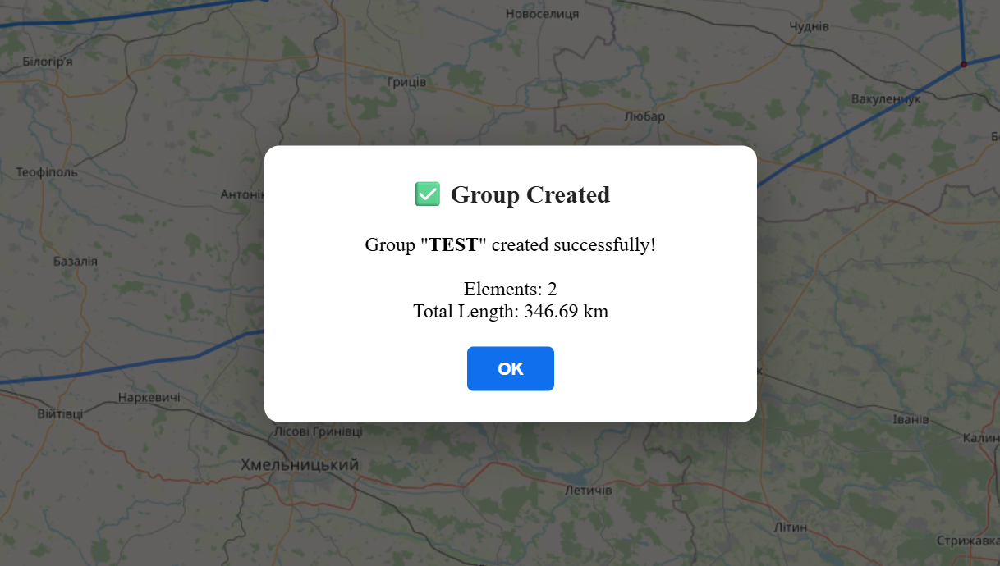

Long pipelines are often found segmented in datasets but share certain attributes. The Group Pipelines tool lets the user virtually group different segments of a single physical pipeline. For that, a group name must be defined initially. Afterward, the individual segments to be grouped must be selected by clicking on them. After the selection, the start and end nodes of the group must be chosen to ensure a common flow direction. After a successful grouping procedure, a prompt featuring the total group length is shown, and the group can be seen in the Groups menu at the main screen.

All created groups are shown in the "Groups" menu in the main screen. When clicking on a group, all corresponding elements are highlighted and are centred on the screen. This tool is practical for group-based manipulations, such as changing certain attributes or defining a standard flow direction. These functionalities will be implemented in the future.

Switch to Sublayer

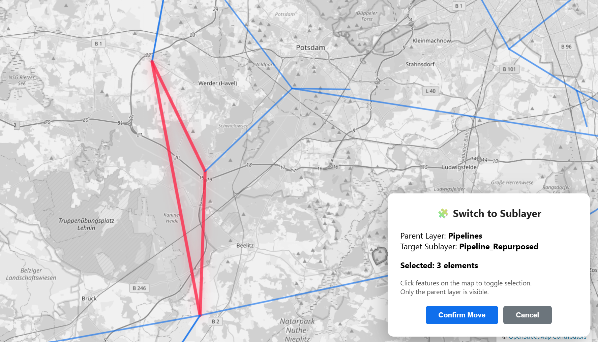

The Switch to Sublayer functionality allows the user to transfer elements from a parent layer, e.g., Pipelines, to a sublayer that shares the same attribute structure. This tool can, for example, be used to indicate pipelines for repurposing for hydrogen transmission or other manipulations. In the first step, the parent layer has to be chosen, which is the basis for the attribute structure of the new layer. Then, a new sublayer can be created, or an existing sublayer can be chosen from previously created ones. The new sublayer will become visible in the legend and can be toggled individually.

After creating the sublayer, the user can start marking elements from the parent layer, which should be moved to the chosen sublayer. The marked elements are shown as red lines. After all elements are selected, the move must be confirmed in a pop-up window in the bottom right corner. After this process, the elements are moved from the parent layer to the sublayer, where sublayer-specific attributes can be added to all elements in this layer.

Add Infrastructure Plans

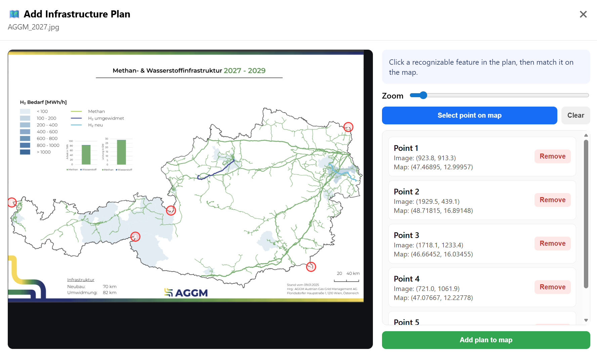

Most institutions or policy makers publish their plans for expanding or changing the gas infrastructure as images, rather than as datasets. To enable their use in QGas projects, the Add Infrastructure Plans tool was developed. This tool allows users to import infrastructure plans in image format, georeference them, and use them as a background for tracing infrastructure assets.

When starting the tool, the user is prompted to load an image file containing the infrastructure plan into the project. After the image is loaded, a pop-up window appears in which the user selects recognizable geographical reference points on the image. After selecting a point on the image, the user can click "Select point on map" to identify the corresponding geographical location on the OpenStreetMap background. The selected image point is then assigned the coordinates of the chosen map location. The more reference points are used in this process, the more accurate the resulting georeferencing is.

After selecting the georeferencing points, the plan can be added to the project by clicking "Add plan to map". The plan then appears as a semi-transparent background layer behind the network topology and can be enabled or disabled in the legend as a separate layer. Note, to add a plan, a minimum of three georeferenced points is required.

Image source: AGGM Austrian Gas Grid Management AG, H2-Roadmap für Österreich – Wasserstoffnetz und Gasinfrastrukturplanung, https://www.aggm.at/energiewende/h2-roadmap/, 2025.

Divide Pipelines

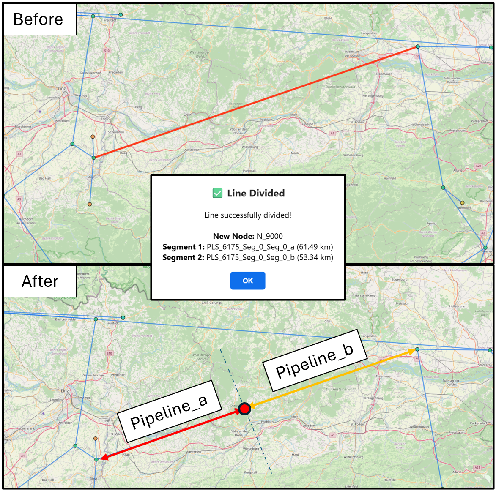

When in reality a pipeline consists of different segments with different attributes (e.g., the diameter changes along the pipeline), but is represented as a single element in the project, the Divide Pipeline tool can be used. After the first pop-up, the user marks the pipeline that should be divided. Then, a confirmation pop-up indicates the start of the division process, where the user must click on a point on the map. The corresponding pipeline is then divided at the point that is closest to the actually clicked location to ensure that the topology is consistent. The two new segments keep the ID of the original element with the suffixes _a and _b. Their lengths are calculated based on the original length and the assigned division point. All other attributes are copied from the original pipeline but can be changed independently afterwards.

Integrate Dataset

The Integrate Dataset tool allows users to import external GeoJSON datasets or entire QGas projects into the active project. Two import modes are available:

<h4>Full Element Import</h4>

Permanently adds data to the project. Two sub-modes are offered:

<ul>
  <li><strong>QGas Project</strong> – Select another project folder from the Input directory. A layer mapping table is shown where each imported layer can be assigned to an existing project layer (features are merged while all attributes from both layers are preserved — missing attributes are set to <code>null</code>) or added as a new standalone layer. Layers not explicitly assigned are added automatically as new layers. The legend, all editing tools, styling, and export are fully available for all imported layers.</li>
  <li><strong>Single Layer</strong> – Import a single <code>.geojson</code> file (preloaded server dataset or local file upload) as a new permanent layer in the project. The layer appears in the legend, can be edited with all tools, and is included in project exports.</li>
</ul>

<h4>Element Mapping Import</h4>

An interactive mode for creating a pairwise equivalence list between a dataset and the existing pipelines. After selecting a source dataset, the imported layer is displayed alongside the project pipelines. Click pipeline segments (highlighted green) and then click the corresponding element in the imported dataset (highlighted orange) to create a link. The resulting equivalence list is exported as a <code>integration_equivalences.json</code> file on completion, which can be used externally to transfer attributes.

Split Node

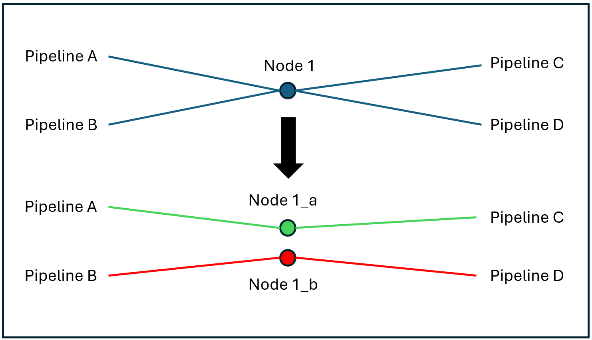

In case pipelines are connected at a node in the dataset, but are only overlapping each other in reality, the Split Node function can be used. The user marks the corresponding node and declares on how many sub-nodes should be created. After that, the corresponding pipeline segments for each sub-node have to be marked. This function then creates multiple sub-nodes at the same location, which are not connected to each other, to physically disconnect the pipelines. The start and end nodes of the corresponding pipelines are changed automatically.

Reconnect Infrastructure

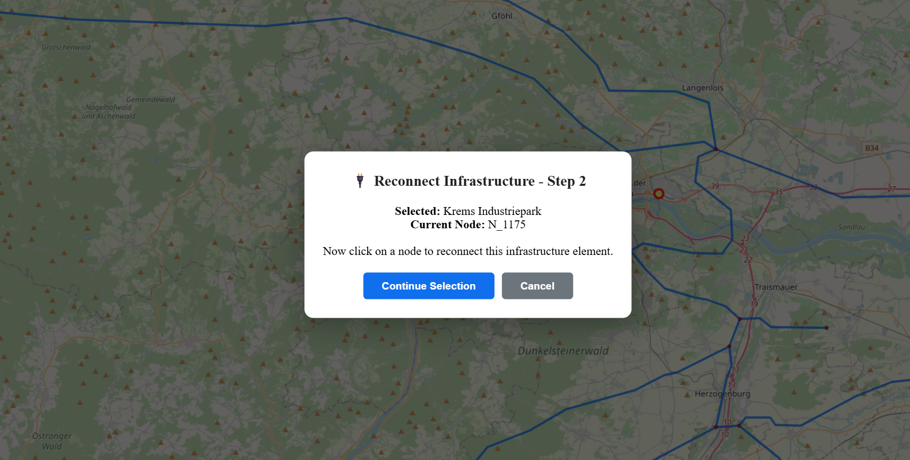

In case an infrastructure point (e.g., LNG terminal, storage, or power plant) is connected to the wrong network node, the Reconnect Infrastructure functionality can be used. This tool allows the user to change the connected node by first clicking on the infrastructure element and then selecting the desired node. The corresponding node ID is then replaced within the attributes of the changed element.

Distribute Compressors

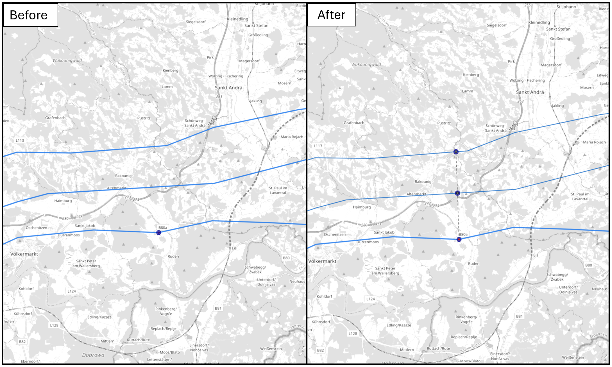

When working with looped pipeline systems, such as the Trans Austria Gas Pipeline, individual loops often share infrastructure components, including compressor stations. In some datasets, these compressor stations are aggregated into a single entity that is associated with only one pipeline of the system. To enable individual modelling of each loop, such aggregated compressor stations can be disaggregated using the Distribute Compressors tool. Using this functionality, the original compressor station is divided into multiple substations, each assigned an averaged power value. The distributed compressor stations are indicated by a small dotted line. In the dataset, these substations are represented as individual compressors and can be manipulated independently. To correctly model all compressor stations, the pipeline is clipped at the compressor locations, splitting it into two segments at each newly created compressor.

Add New Element

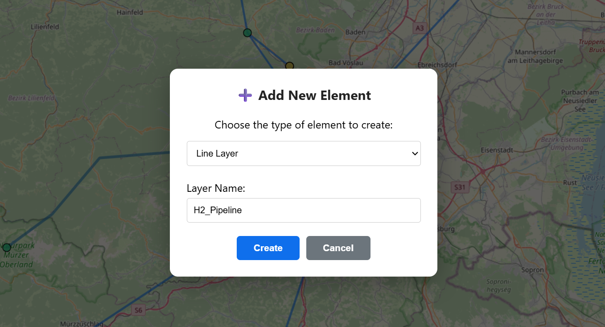

If the user wants to add entirely new elements to the dataset - for example, electrolyzers or hydrogen pipelines - the Add New Element tool can be used. This tool allows users to create new layers by selecting a type and name. The user can choose between line-type layers, which can be manipulated in the same way as pipelines, point-type layers, which are treated like other infrastructure elements, and in-line elements, which are handled in the same manner as compressors. The newly created layers are initialized with a default set of attributes, which can then be modified flexibly in the information mode.

Topology Checker

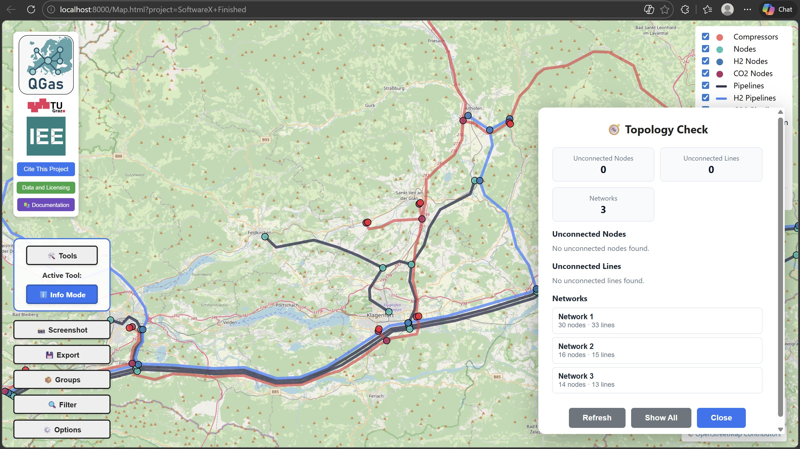

The Topology Checker validates the network after edits to ensure that pipelines and nodes remain consistent. It scans the dataset for common topology problems introduced by geometry changes or edits.

Typical checks include:

<ul>
<li>Disconnected pipeline endpoints (start or end node missing)</li>
<li>Nodes without any connected pipelines</li>
<li>Count of isolated network islands (unconnected sub-networks)</li>
</ul>

Run the checker after larger edits (routing, splitting, grouping, or deletion) and before exporting. This helps prevent invalid networks and reduces errors in downstream analyses.

